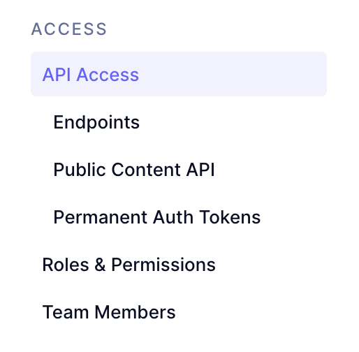
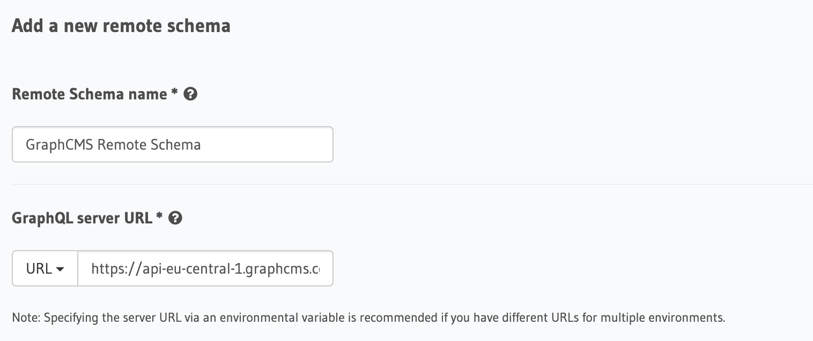
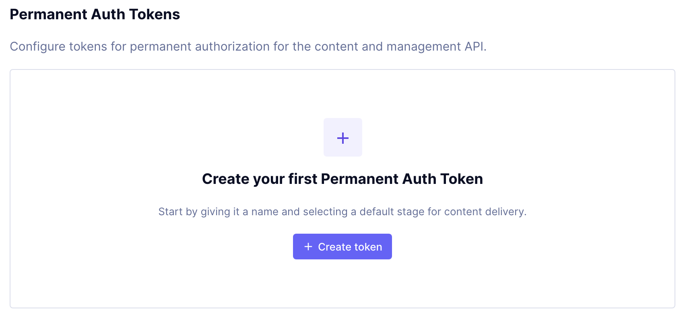
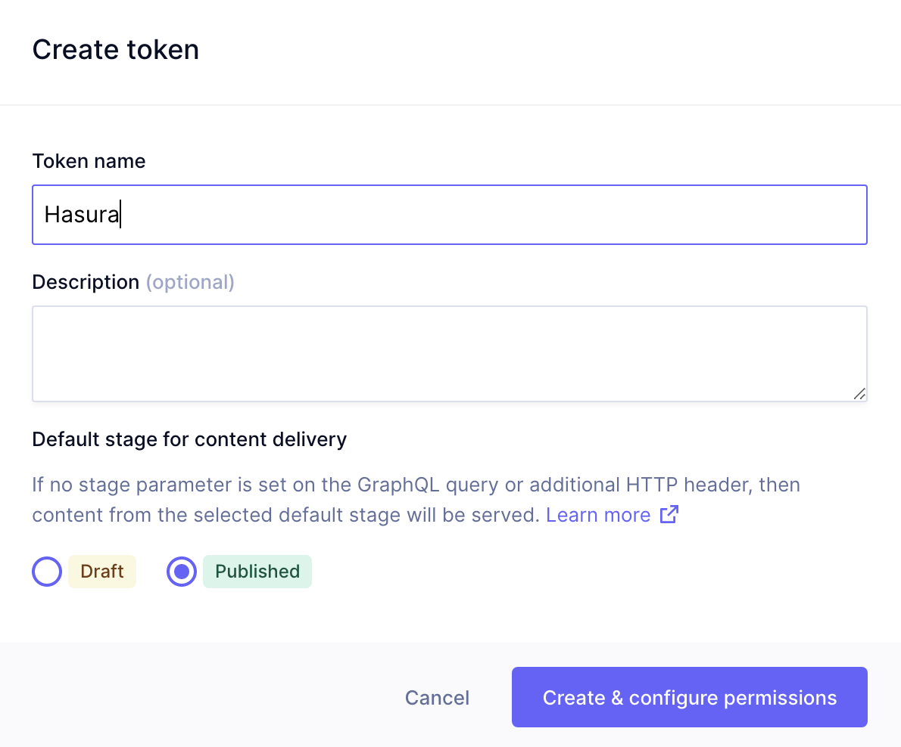
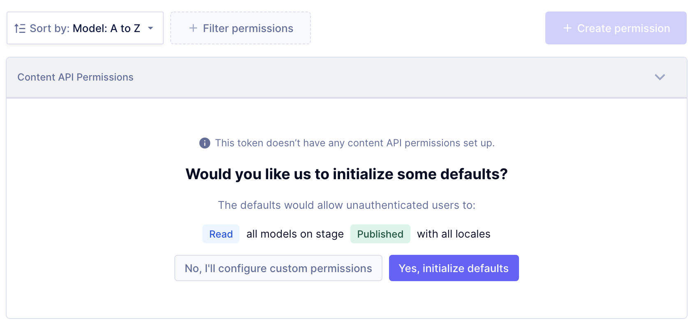
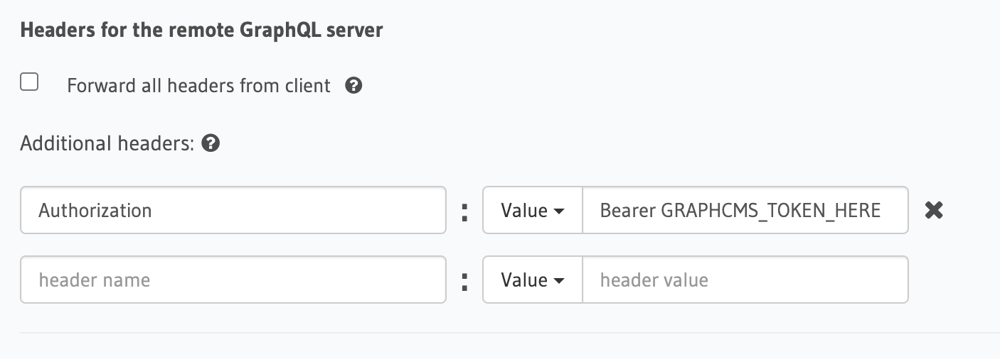

# Adding GraphCMS as a Remote Schema

## Copy your API endpoint

1. Get the Content API endpoint from your project API access settings.  
   
   
2. Add your endpoint to Hasura's remote API config.  
   

If your API is open, your work is done. If your API is not open, continue below.

## Set your content access controls (optional)

If your project is not open to all (Public API Permissions), then you will want to create a Permanent Auth Token.

1. Inside your API access settings, click "Create token". Give it a name, and set the stage which content should be delivered from - typically "Published".  
   
   
   
2. Set your Content API Permissions. You can initialize the defaults (read all published models with all locales), or configure specific models in which Hasura can access.  
   
3. Then add the following Authorization header to the remote schema config:
   `Authorization: Bearer GRAPHCMS_TOKEN_HERE`
   
